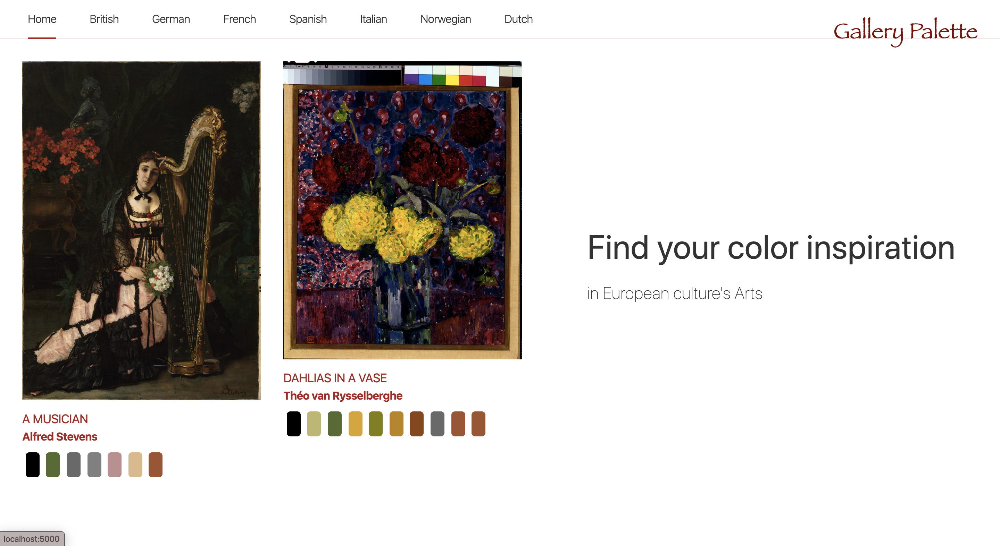

# Gallery Palette

## Overview

This web app with routers (as multi-page app) is built using Svelte and consumes data from Harvard's Art Museum API. It allows a user to find a palette based on European Culture's masterpieces.

## Tech stack

- Svelte
- Jest

## Screenshots

**Home page**

**Gallery**

